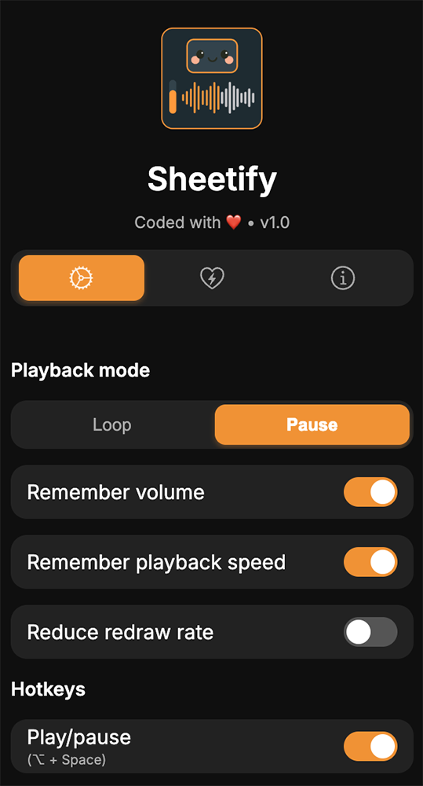
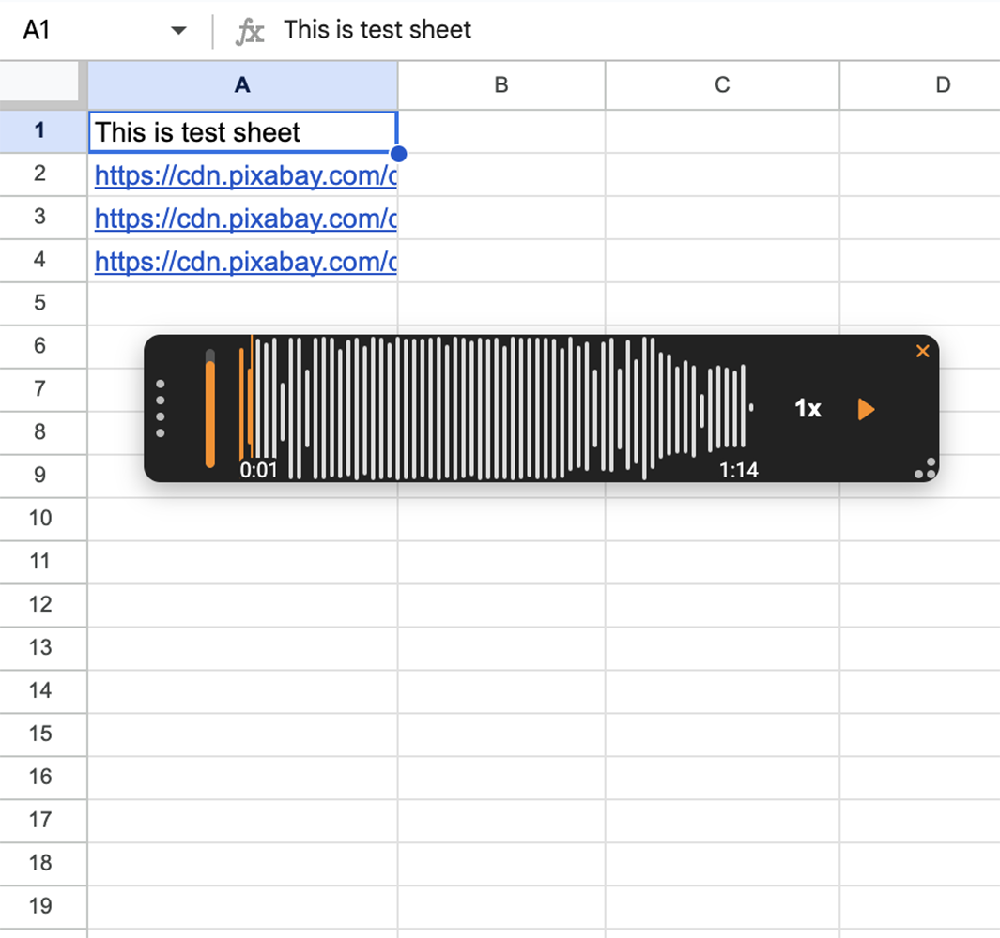

# Sheetify - Google Sheet Audio Player

  

## Screenshots

  
View screenshots

  <table>
    <tr>
      <td></td>
      <td></td>
    </tr>
  </table>

## About & Features
> [!NOTE]
> Sheetify lets you play audio files linked by URLs in a floating player <strong>right inside your Google Sheets tab</strong> - no need to download files or open new tabs.
>

<li>Play audio files (obviously! :D)</li>
<li>Adjust and remember volume and playback speed</li>
<li>Drag the player using the left grabber</li>
<li>Resize the player from the bottom-right corner grabber</li>
<li>Choose to loop playback or pause at the end</li>
<li>Supports hotkeys and custom seek time</li>
 

## How to install Sheetify

  
For Chromium-based browsers (Chrome, Edge, etc.)

  <ol>
    <li>Download <strong>Sheetify</strong> by clicking <strong>Code</strong> → <strong>Download ZIP</strong> in this repository</li>
    <li>Unzip the downloaded <strong>Sheetify archive</strong></li>
    <li>Open your browser</li>
    <li>Click the menu button (three dots) at the top right → select <strong>Extensions</strong> → then <strong>Manage extensions</strong></li>
    <li>Enable <strong>Developer mode</strong></li>
    <li>Click <strong>Load unpacked</strong> and select the <strong>extension</strong> folder inside the extracted Sheetify directory</li>
    <li>The extension will be loaded and ready to use immediately</li>
  </ol>

  
Firefox

  <ol>
    <li>Install via <a href="https://addons.mozilla.org/en-US/firefox/addon/sheetify-google-sheet-player">Mozilla Add-Ons</a></li>
  </ol>

 

## Credits
<li><a href="https://github.com/katspaugh/wavesurfer.js">WaveSurfer.js</a></li>
<li><a href="https://fonts.google.com/specimen/Inter">Inter</a></li>
